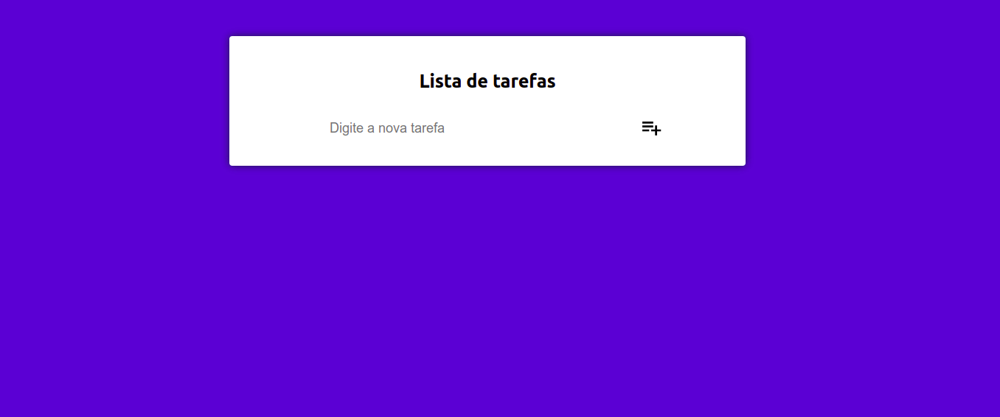
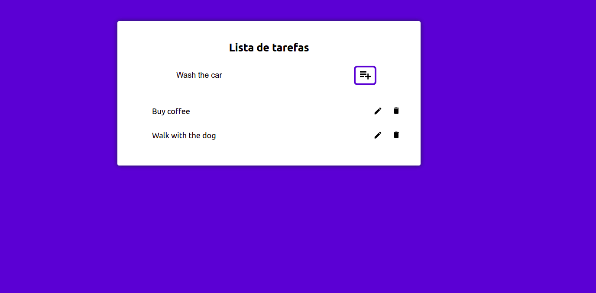

# To-do list

Project created thinking about solving my problem with remembering to solve daily tasks

Project link: [https://to-do-lists-alpha.vercel.app/](https://to-do-lists-alpha.vercel.app/)

## To develop I used these technologies:

React.JS, HTML, CSS, react-icons, eslint and posted on vercel 
#

## Project images

# Getting Started with Create React App

This project was bootstrapped with [Create React App](https://github.com/facebook/create-react-app).

## Available Scripts

In the project directory, you can run:

### `npm install`

To install the required dependencies

### `npm start`

Runs the app in the development mode.\
Open [http://localhost:3000](http://localhost:3000) to view it in your browser.

The page will reload when you make changes.\
You may also see any lint errors in the console.

